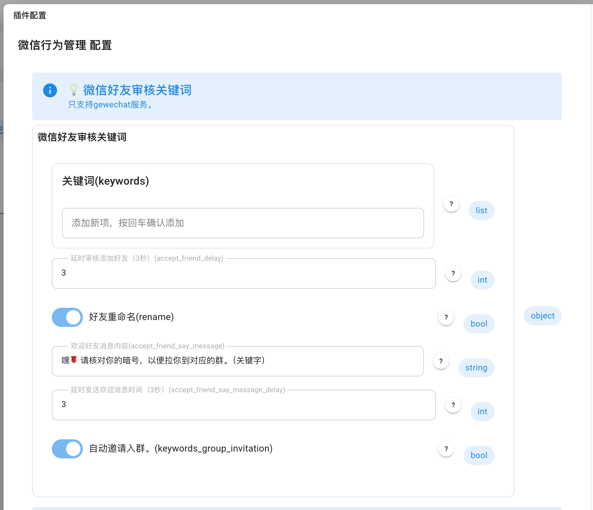
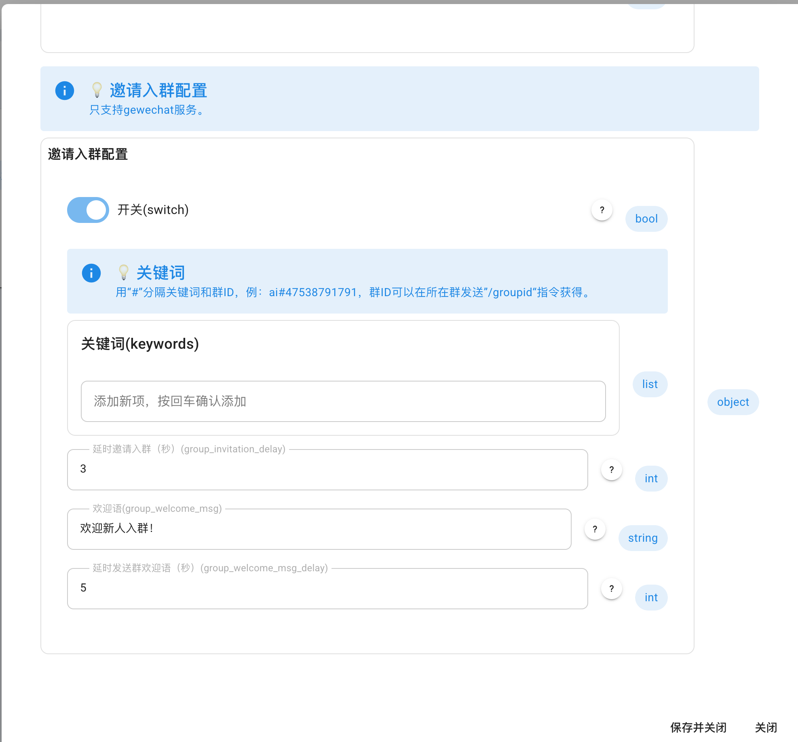

<!--
 * @Author: diudiu62
 * @Date: 2025-02-17 10:10:40
 * @LastEditTime: 2025-03-24
-->

# 微信行为管理

使用 [gewechat-python](https://github.com/hanfangyuan4396/gewechat-python) 

实现的gewechat api接口，完成微信的相关服务。

# 功能介绍

基于AstrBot的微信（gewechat）行为管理，如好友自动审核\关键字进群管理。

还需要什么功能，可以提issus

# 支持

[帮助文档](https://astrbot.soulter.top/center/docs/%E5%BC%80%E5%8F%91/%E6%8F%92%E4%BB%B6%E5%BC%80%E5%8F%91/)
